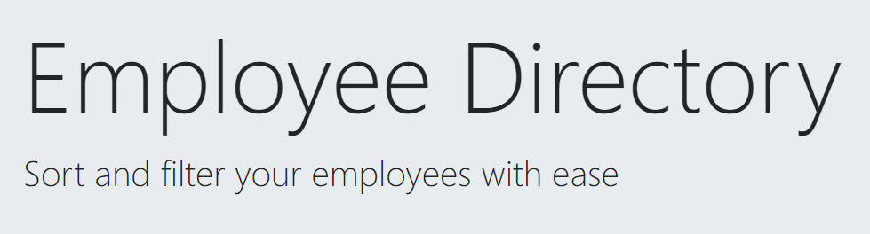

# Budget Tracker  
this employee directory is built with a React application. The UI of this app is broken up into three components; EmployeeListContainer, ResultList, Filter, and Jumbotron. Component state is manipulated to pass data from the randomUser API and user events are responeded to with useEffect. 

<p align="center">
    
</p>

## Table of Contents:
* [Installation](#installation)
* [Usage](#usage)
* [License](#license)
* [Contributing](#contributing)
* [Tests](#tests)
* [Questions](#questions)
### Installation:
In order to install the necessary dependencies, open the console and run the following:
```npm install```
### Usage:
A user is able to view an entire list of their employees, sort by last name, and filter by first name, last name, gender, city, and state.

<p align="center">
    
</p>

### License:
This project is licensed under:
MIT
### Contributing:
Contributions are welcome. Please sumbit contributions via email for approval and integration. 
### Tests:
In order to test open the console and run the following:
```npm test```
### Questions:
If you have any questions contact me on [GitHub](https://github.com/sambishop3015) or contact 
Sam Bishop	 at sambishop3015@hotmail.com

        
